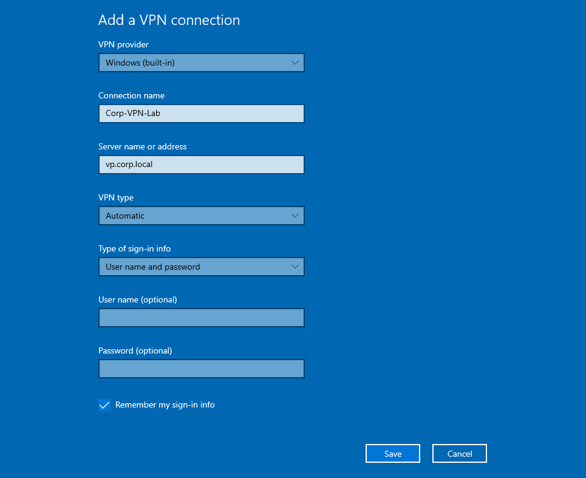
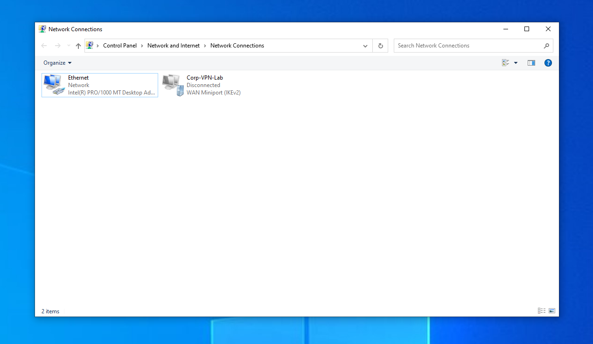
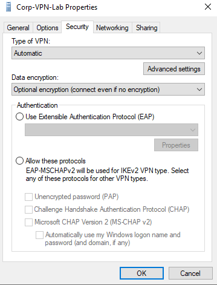
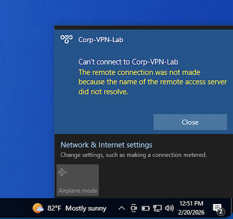

## Lab Overview

In this lab, I configured a Windows 10 built-in IKEv2 VPN profile and walked through a structured troubleshooting process after the connection failed.

The goal wasn’t just to “set up a VPN,” but to identify exactly where connectivity was breaking and validate the root cause using layered troubleshooting.

This lab focuses specifically on diagnosing a VPN connectivity issue related to **DNS resolution**.

---

## 🖥 Lab Environment

- Windows 10 (Virtual Machine)
- Built-in Windows VPN Client (IKEv2)
- VPN Hostname: `vp.corp.local`
- Troubleshooting Tool Used: `nslookup`


---

## Step 1 – VPN Profile Creation

Created a Windows built-in VPN connection named `Corp-VPN-Lab` using the hostname `vp.corp.local`.

This confirms the VPN profile was successfully configured on the client.



---

## Step 2 – Adapter Verification

Verified the VPN adapter was created under:

Control Panel → Network and Internet → Network Connections

Observed:
- WAN Miniport (IKEv2)
- Status: Disconnected

This confirms the profile exists at the OS level.



---

## Step 3 – Security Configuration Review

Reviewed the Security tab of the VPN properties to confirm:
- VPN type set to Automatic (IKEv2)
- Encryption options present
- Authentication protocol available

This confirms the issue is not related to encryption or authentication configuration.



---

## Step 4 – Networking Stack Verification

Reviewed the Networking tab and confirmed:
- IPv4 enabled
- IPv6 enabled
- Microsoft networking components present

This verifies the VPN adapter is properly bound to the TCP/IP stack and there is no missing protocol issue.


---

## Step 5 – Connection Attempt

Attempted to connect to the VPN.

Received the error:

> The remote connection was not made because the name of the remote access server did not resolve.

The wording of this error suggests a DNS resolution issue rather than authentication failure.



---

## Step 6 – DNS Validation

Executed:

```bash
nslookup vp.corp.local
