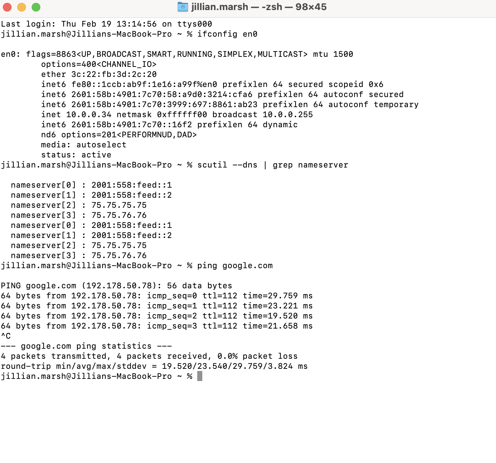
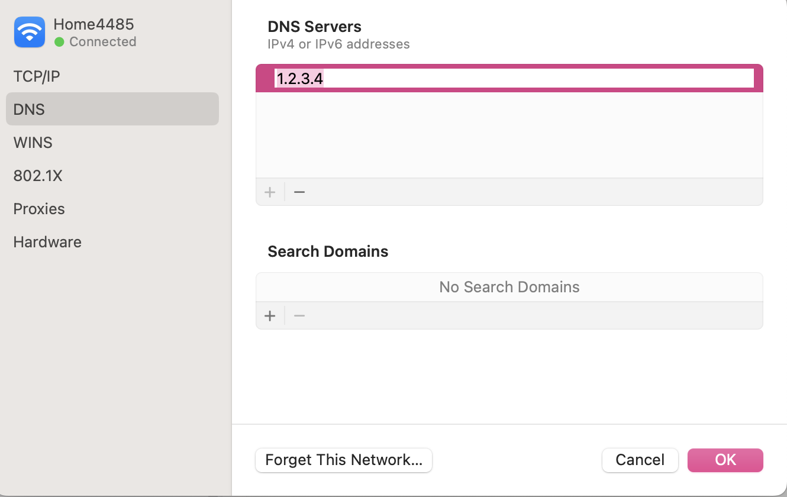
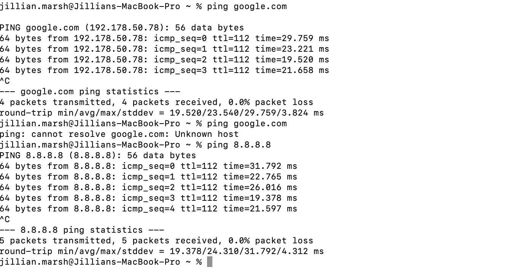
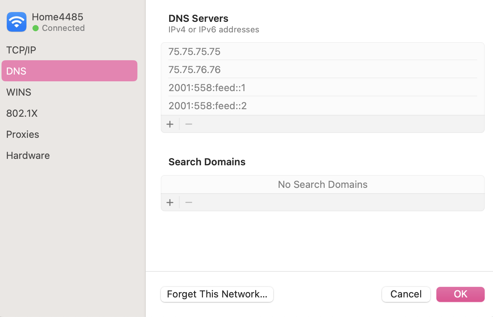
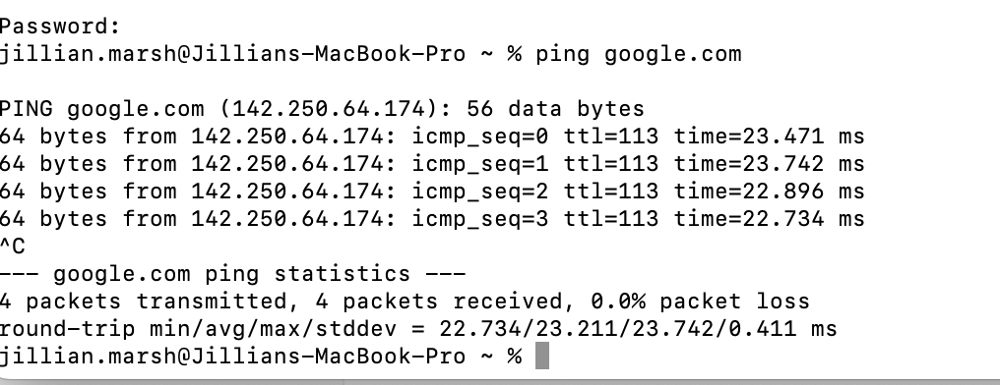

# DNS Misconfiguration Simulation (macOS)

## Objective

Simulate a DNS failure on macOS and troubleshoot the issue by isolating hostname resolution from IP connectivity.

---

## 1. Baseline Validation

Before introducing failure, network connectivity and DNS resolution were verified.

Commands used:

```
ifconfig en0
scutil --dns | grep nameserver
ping google.com
```


Result:  
Network connectivity and hostname resolution were functioning normally.
### Screenshot




---

## 2. Failure Simulation

Manually changed the DNS server to an invalid address:
1.2.3.4


This simulates a common enterprise issue where DNS settings are misconfigured.



---

## 3. Issue Identification

Connectivity tests performed:
ping google.com
ping 8.8.8.8


Observed behavior:

- `ping google.com` → Failed (hostname could not resolve)
- `ping 8.8.8.8` → Succeeded (IP connectivity working)

Conclusion:  
The network layer was operational, but DNS resolution was failing.

Root cause identified as DNS misconfiguration.



---

## 4. Resolution

Restored original DNS settings.

Flushed DNS cache:
```
sudo dscacheutil -flushcache
```



---

## 5. Validation

Re-tested hostname resolution:
```
ping google.com
```

Result:  
Hostname resolution restored successfully.



---

## Skills Demonstrated

- Layered troubleshooting methodology
- Isolation of hostname vs IP connectivity
- DNS diagnostics on macOS
- Root cause analysis and validation testing
- Use of terminal networking tools


