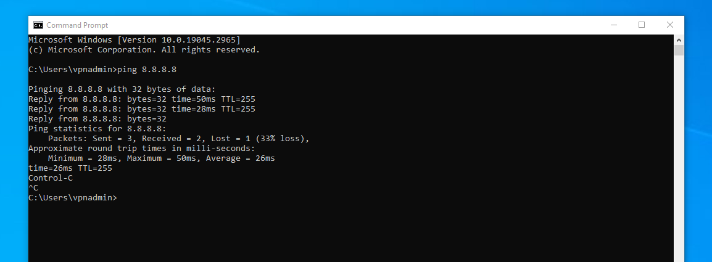
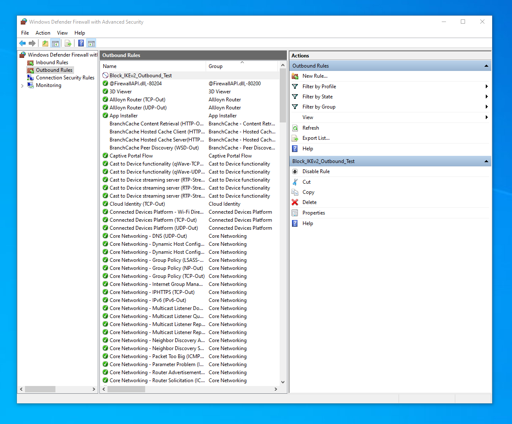
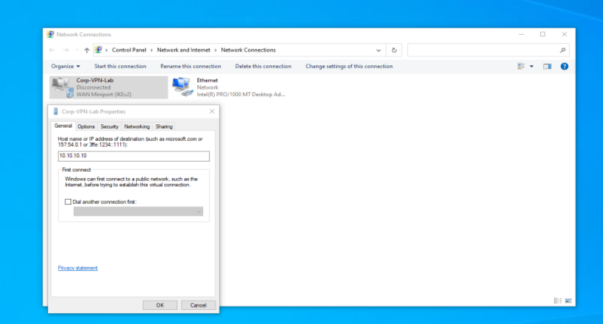
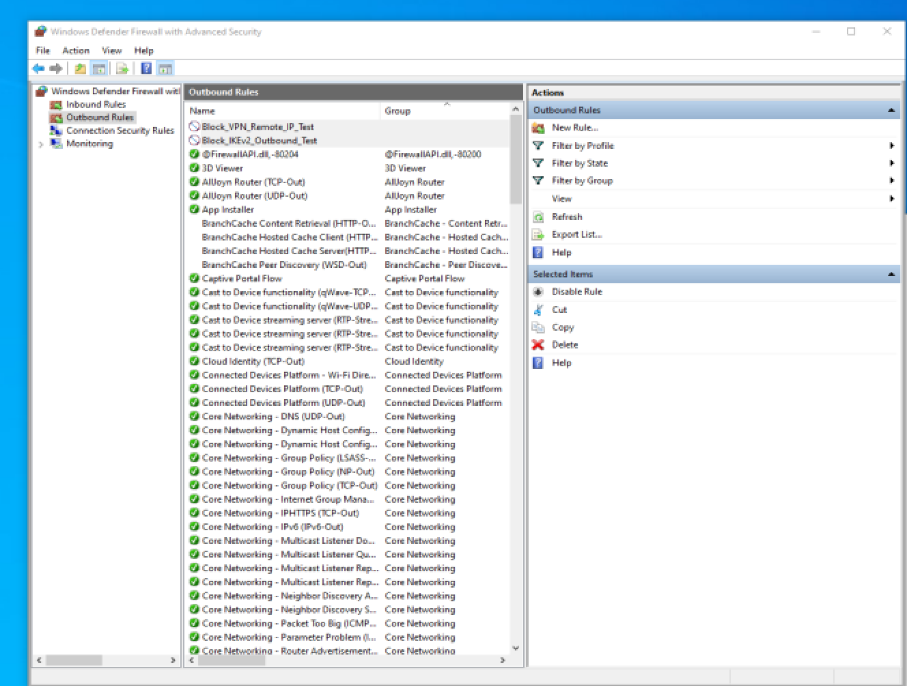
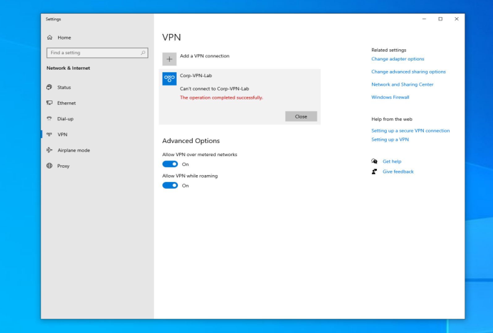
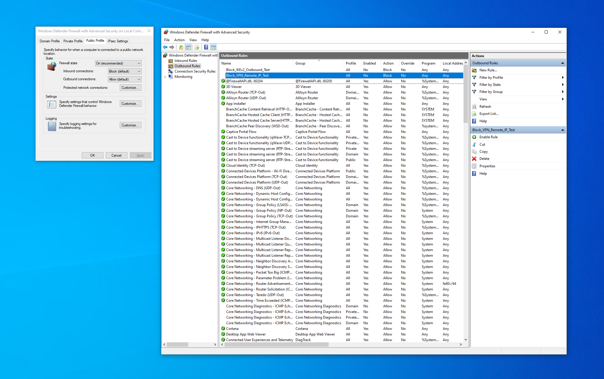

# Windows Firewall VPN Troubleshooting Lab

## Overview

In this lab, I simulated a VPN connectivity failure caused by an outbound Windows Defender Firewall rule.

The objective was to intentionally block IKEv2-related traffic, observe how it impacted VPN tunnel negotiation, isolate potential variables such as DNS, and then restore the configuration to confirm root cause resolution.

This lab demonstrates structured troubleshooting rather than simple configuration.

---

## Lab Environment

- Windows 10 Virtual Machine  
- Windows Built-in IKEv2 VPN Client  
- Windows Defender Firewall with Advanced Security  

---

---

## Step 1 – Establish Baseline Connectivity

Before modifying any firewall settings, I verified outbound internet connectivity to confirm normal network behavior.

**Command Executed:**

```powershell
ping 8.8.8.8
```

This confirmed the system had working internet access prior to introducing firewall restrictions.

**Screenshot File:** `01_Baseline_Internet_Connectivity.PNG`



---

## Step 2 – Create Outbound Firewall Block Rule

Created a custom outbound firewall rule to intentionally block IKEv2-related traffic.

**Action Performed:**

```powershell
Windows Defender Firewall with Advanced Security
→ Outbound Rules
→ New Rule
→ Custom
→ Block Connection
```

This introduced a controlled VPN connectivity failure for troubleshooting validation.

**Screenshot File:** `02_Firewall_Block_IKEv2_Rule_Created.PNG`



---

## Step 3 – Eliminate DNS as a Variable

Modified the VPN configuration to use the server’s direct IP address instead of a hostname.

**Action Performed:**

```powershell
Control Panel
→ Network Connections
→ Corp-VPN-Lab Properties
→ Replace hostname with IP address
```

This ensured DNS resolution was not contributing to the issue.

**Screenshot File:** `03_VPN_Server_Changed_To_IP.png`



---

## Step 4 – Apply Remote IP Block Rule

Configured a targeted outbound firewall rule blocking traffic specifically to the VPN server IP address.

**Action Performed:**

```powershell
Windows Defender Firewall
→ Outbound Rules
→ New Rule
→ Custom
→ Remote IP
→ Block
```

This ensured VPN tunnel negotiation would fail due to outbound restrictions.

**Screenshot File:** `04_Firewall_Remote_IP_Block_Rule.png`



---

## Step 5 – Observe VPN Connection Failure

Attempted to reconnect to the VPN profile after applying the outbound block rule.

**Action Performed:**

```powershell
Settings
→ Network & Internet
→ VPN
→ Connect to Corp-VPN-Lab
```

The VPN failed to connect as expected, confirming firewall policy was preventing tunnel establishment.

**Screenshot File:** `05_VPN_Failure_With_Firewall_Block.png`



---

## Step 6 – Disable Rule and Validate Resolution

Disabled the custom outbound firewall rule to restore normal outbound traffic behavior.

**Action Performed:**

```powershell
Windows Defender Firewall
→ Outbound Rules
→ Right-click Custom Rule
→ Disable
```

VPN connectivity returned to normal, validating the firewall rule as the root cause.

**Screenshot File:** `06_Firewall_Rule_Disabled_Restored_State.png`


